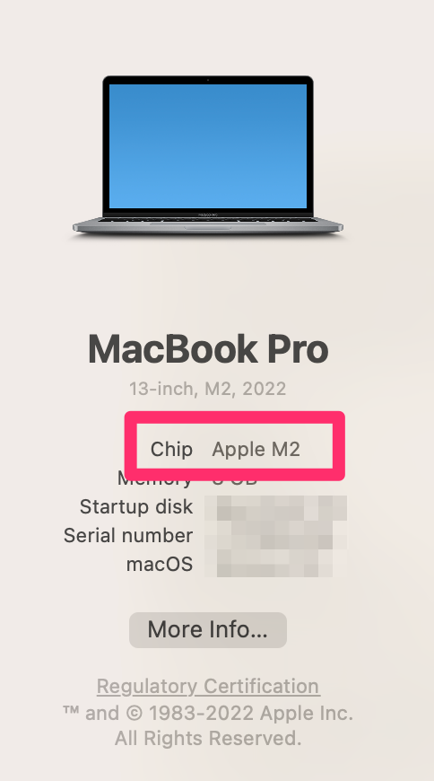
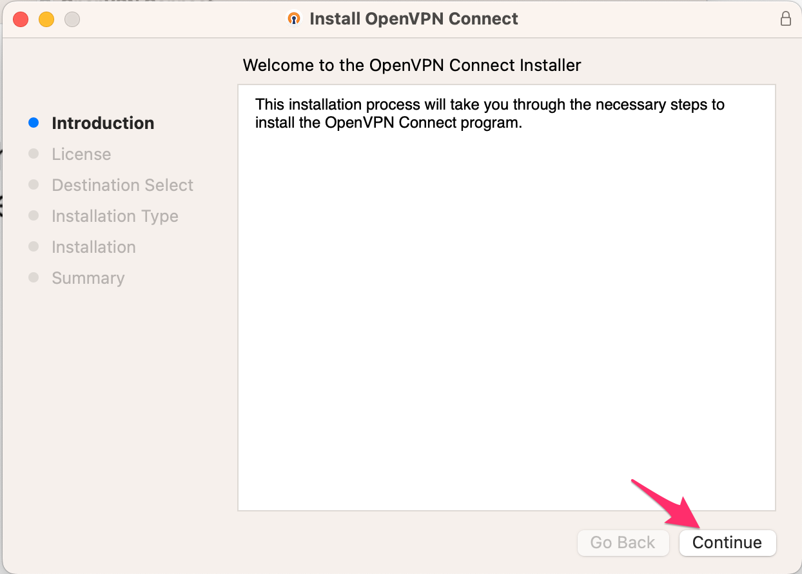
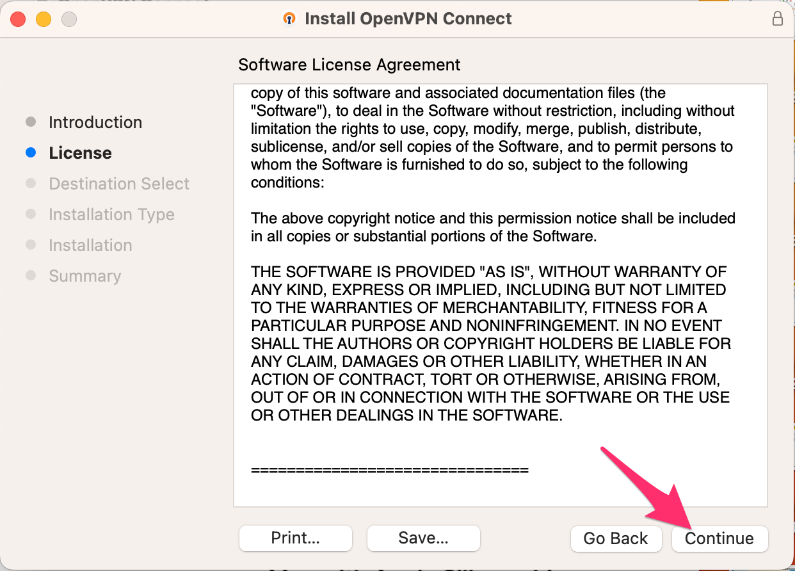
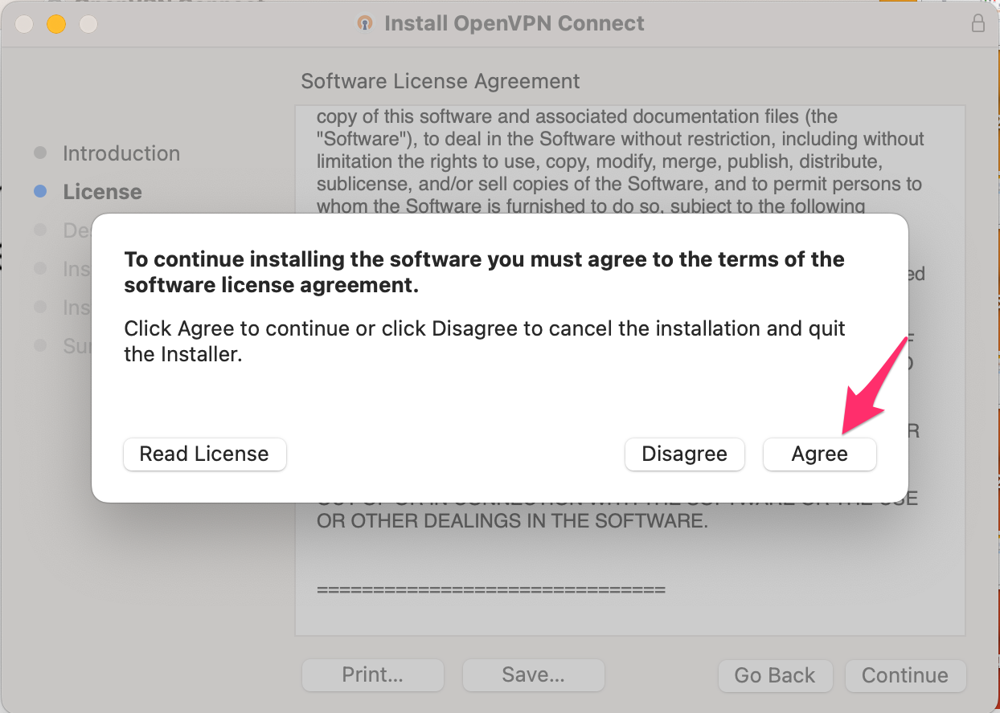
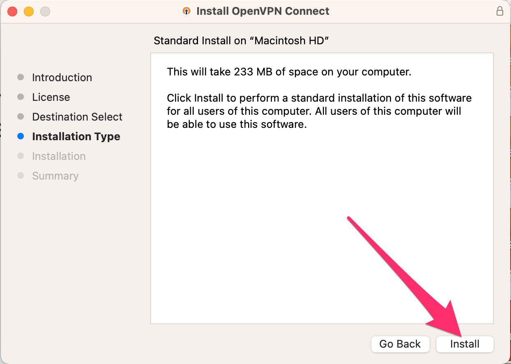
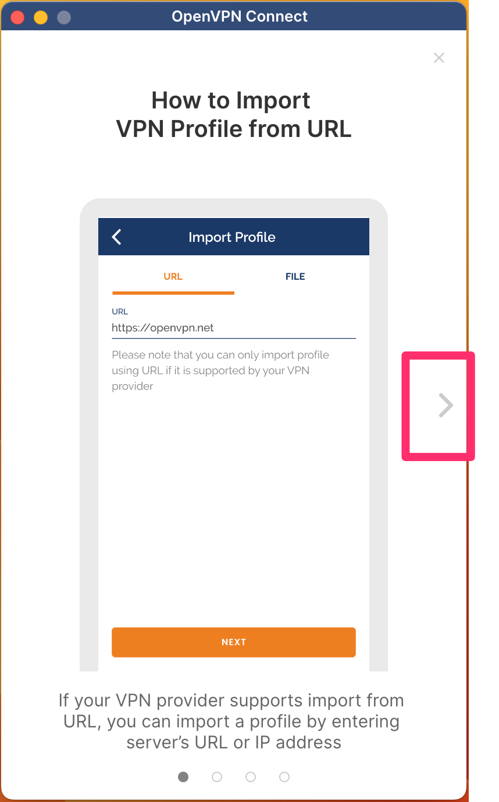
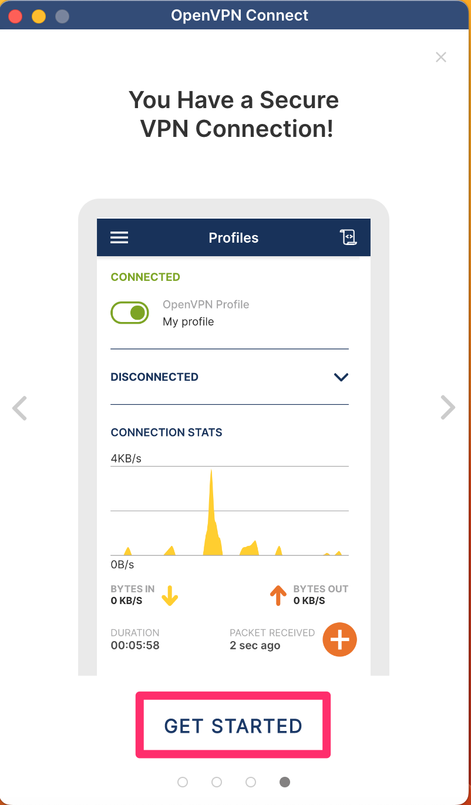
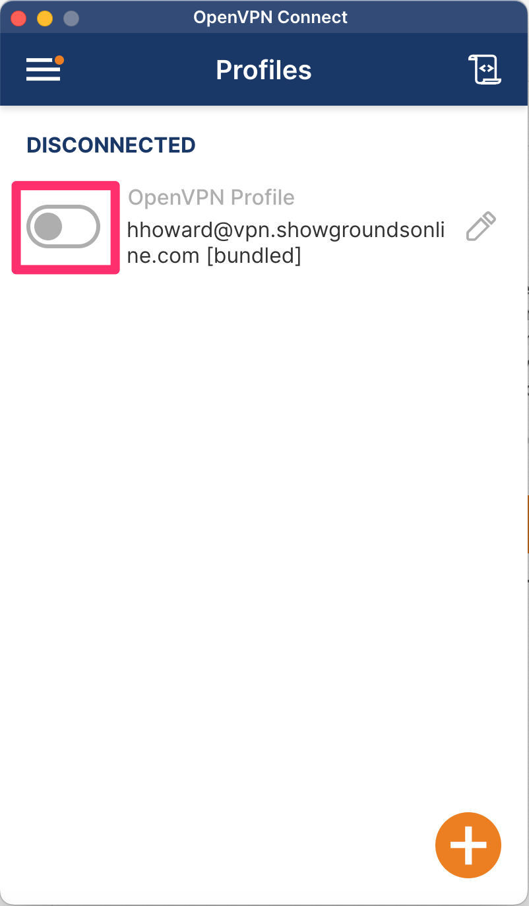

# OpenVPN Installation and Setup

## Windows Installation Directions

[**Made by Jaimee Tempestas with Scribe**](https://scribehow.com/shared/Access\_VPN\_Sign\_In\_Page\_on\_Showgrounds\_Online\_\_qQ33WBKXQ\_qcq\_ghuJ1L3g)

1. &#x20;Navigate to [https://vpn.showgroundsonline.com/](https://vpn.showgroundsonline.com/?src=connect)
2. &#x20;Enter your credentials and click "Sign In" (The credentials used in this login section are the credentials you use to log into the RDP connection.)

3. Click on the icon under "OpenVPN Connect Recommended for your device:" This option should match up to the device you are using. When you are on a windows-based device, the Windows icon will show automatically.&#x20;

4. Find your downloads, you can either access your recent downloads through whichever internet browser you are using or you can go to your downloaded files on your computer.

5. a. Depending on your device and security settings, you may receive a warning. The following is an example for computers that have Microsoft Defender enabled. &#x20;

&#x20;       b.  Choose the "Run anyway" option to continue with installation.

6. If you are working from a Mac computer, you will need to choose a specific installer for your operating system. If you are working on a Windows, you can proceed to step 7.

<figure><figcaption></figcaption></figure>

To determine which is the correct operating system for your computer, go to the Apple logo in the top left corner of your computer screen and click About This Mac.

<figure><figcaption></figcaption></figure>

This screen will show you whether your computer operates with an Intel processor or with an Apple Chip.&#x20;

<figure><figcaption>
In this example, the operating system is the Apple Chip.
</figcaption></figure>

7. The "OpenVPN Connect Setup" Wizard window will open.

8. Click "Next to continue.

9. The next step will be to review the License Agreement. Once you have reviewed, click the checkbox to accept the terms of the agreement.

10. Click "Next" to continue.&#x20;

11. Click here to install.&#x20;

\*This step does require Administrative access. If you are not the administrator on your particular device, you will need to have the administrator of the device continue with the process.&#x20;

12. Click here to finish installation.

13. Once opened, it will direct you on how to import a profile, but this will not be necessary for our purposes. Click the arrow on the right-hand side of the page to continue.

14. Click Get Started.

15. You will need to review the terms of using OpenVPN Connect. Once you have reviewed these terms, choose the Agree option to continue.&#x20;

16. Review updates. Choose Ok to continue.&#x20;

17. You have successfully installed the VPN! To turn on the VPN, you will choose the highlighted button.&#x20;

## Mac Installation Directions

1. Navigate to [https://vpn.showgroundsonline.com/](https://vpn.showgroundsonline.com/)&#x20;
2.  Enter your credentials and click "Sign In" (The credentials used in this login section are the credentials you use to log into the RDP connection.)

    <figure><figcaption></figcaption></figure>
3.  Click on the icon under "OpenVPN Connect Recommended for your device:" This option should match up to the device you are using. When you are on a Mac device, the Apple icon will show automatically.&#x20;

    <figure><figcaption></figcaption></figure>

4.  Find your downloads, you can either access your recent downloads through whichever internet browser you are using or you can go to your downloaded files on your computer.

    <figure><figcaption>
This example shows the openvpn download in the Safari browser. 
</figcaption></figure>

5.  When you open the download, it will open a screen for you to choose and installer based on the operation system of your device.&#x20;

    <figure><figcaption></figcaption></figure>

    To determine the correct operation system of your computer, you will click on the Apple icon in the top left-hand corner of your computer screen. From that menu, you will choose About This Mac.

    <figure><figcaption></figcaption></figure>

    This will bring up a screen providing details about that specific device, but you will want to pay attention whether the system runs on an Intel processor or an Apple Chip.&#x20;

    <figure><figcaption>
In this example, this device runs on an Apple Chip.
</figcaption></figure>

    Choose the correct installer to continue.
6.  A screen will appear with several steps. The first step is an introduction to the installation of OpenVPN Connect. Click Continue to move on to the next step.&#x20;

    <figure><figcaption></figcaption></figure>

7.  The next step is reviewing the License Agreement. Once you have reviewed, you will hit Continue again.&#x20;

    <figure><figcaption></figcaption></figure>

8.  A popup screen will appear. This screen prompts you to agree to licensing agreement to continue with the installation. Click Agree to continue.&#x20;

    <figure><figcaption></figcaption></figure>

9.  The next step is the option to continue with the installation. Click the Install button to begin the installation.&#x20;

    <figure><figcaption></figcaption></figure>

    For this step, you must have Administrative privileges on your computer. Your computer will prompt the admin to log in to allow for the download.&#x20;

    <figure><figcaption></figcaption></figure>

10. Once the administrator has entered the password and chosen to install the software, the software will be installed on the computer. Once the installation is complete, the box will show that the installation was successful.&#x20;

    <figure><figcaption></figcaption></figure>

    When you hit close, you will be asked if you want to keep the OpenVPN Connect Installer or move it to trash. It is highly suggested to keep it just in case.&#x20;

    <figure><figcaption></figcaption></figure>

11. You will then open your OpenVPN Connect icon and the following screen will show. You will not be importing a profile, so you will just click the arrow on the right side of the screen.

    <figure><figcaption></figcaption></figure>

    You will continue to hit that arrow until you get to the 4th page. On that page, you will want to click Get Started.

    <figure><figcaption></figcaption></figure>

12. You will need to review OpenVPN's data collection policy. Once you have reviewed, click the Agree button to move on.&#x20;

    <figure><figcaption></figcaption></figure>

13. This will bring you to the page with your profile. Currently the VPN is disconnected.&#x20;

    <figure><figcaption></figcaption></figure>

    To turn on the VPN, you will hit this button.&#x20;

    <figure><figcaption></figcaption></figure>

    You will be prompted to enter your password. This is the password you use for your RDP connection.&#x20;

    <figure><figcaption></figcaption></figure>

    Once you have entered your password and hit Ok, your VPN will show as connected.&#x20;

    <figure><figcaption></figcaption></figure>

[**Made with Scribe**](https://scribehow.com/shared/Access\_VPN\_Sign\_In\_Page\_on\_Showgrounds\_Online\_\_qQ33WBKXQ\_qcq\_ghuJ1L3g) [**Made with Scribe**](https://scribehow.com/shared/Setting\_Up\_OpenVPN\_Connect\_on\_Windows\_Using\_Windows\_PowerShell\_\_0xRlG\_LqQv-qy-GCrJitLg)
