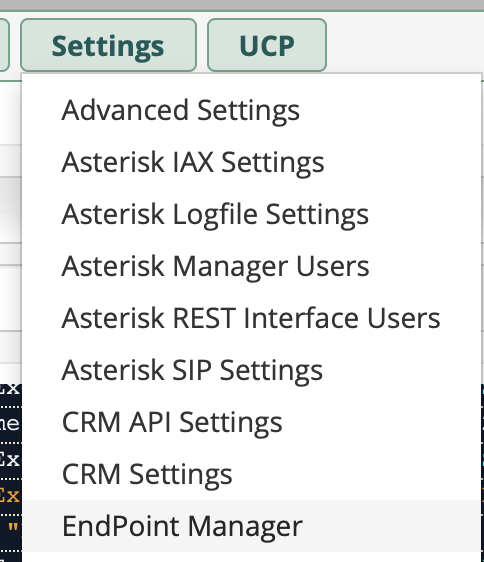
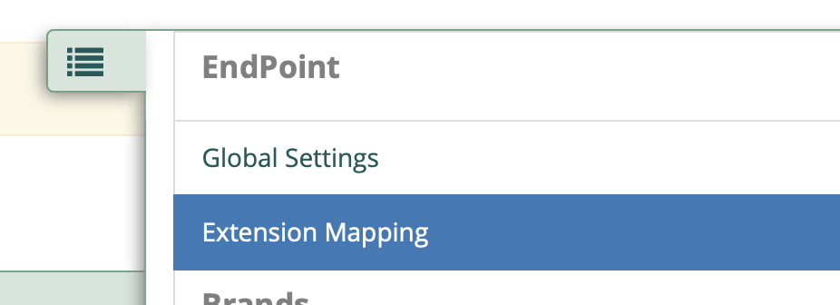
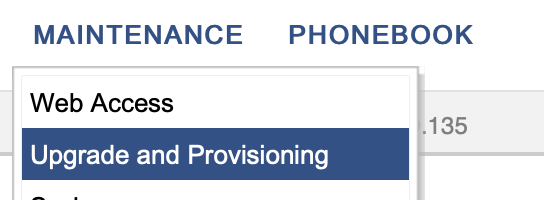
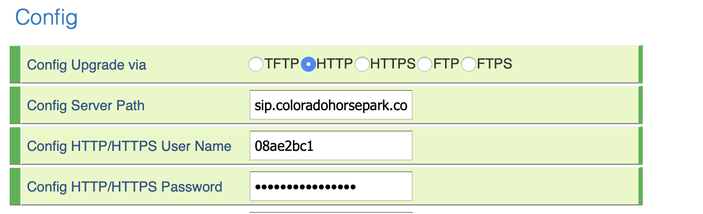

# FreePBX - Setting Up New Extension

## FreePBX Extension Setup 

Basic setup has to be done in FreePBX to create the extension and then the phone needs to be configured to reach the endpoint manager to pull it’s configuration.

1. Login to [http://sip.showgroundsonline.com](http://sip.showgroundsonline.com)
2. Go to Application - > Extensions
3. Create Extension as PJSIP type
   1. General - Enter extension number
   2. General - Display Name
4. Click on Voicemail Tab
   1. Set password to extension number as default password
   2. Set email address for VMs to be sent to.
   3. Set VM options like this\
      \
      .png>)
5. Go to Settings -> Endpoint Manager\
   
6. Goto Extension Mapping\
   
7. Add Extension
   1. Identify extension, account (Account 1), Phone, Mac Address etc.
   2. Save and Rebuild Configs
8. Configure Phone
   1. Boot
   2. Open Menu and go to “Info”
   3. Network Info
   4. Open Browser and go to IP for phone
   5. Login with admin/admin
   6. T54W
      1. Go Left Nav -> Settings -> Auto Provisions
      2. Set configuration server path to: \
         http://sip.showgroundsonline.com:84/
      3. Username: cfff9682
      4. Password: b3a39f7d5e931eb5
      5. Then auto provision, which will reload the page.
   7. Other phone
      1. Go to Maintenance -> Upgrade and Provisioning\
         
      2. Set upgrade via to HTTP
      3. Set HTTP Username to: cfff9682
      4. Set HTTP Password to: b3a39f7d5e931eb5\
         
      5. Save and Apply
      6. Reboot Phone
   8. After reboot, the phones username and password will change to "admin" and "R3dn0der0cks"
