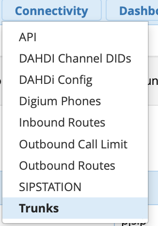
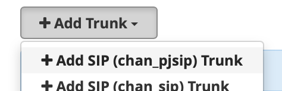
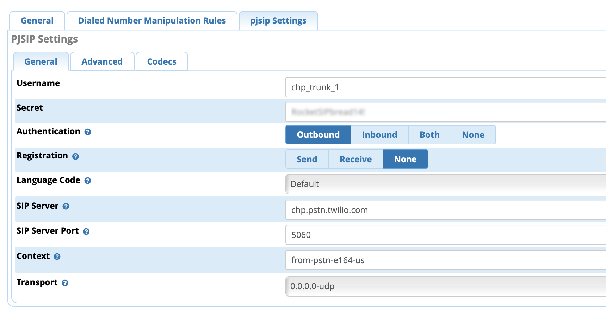
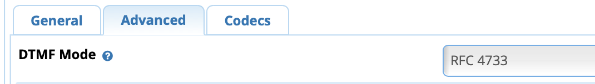

# ShowGrounds Phone System - General Documentation

### Overview 

Setup new phone system. We will be

1. Using AWS EC 2 instance running FreePBX. This is running under the ESP AWS Account.
2. Port SGL phone numbers to Twilio
3. Setup Numbers as FPBX trunks
4. Setup extensions
5. Setup Voice mail
6. Setup IVR

### Information From Facility Manager 

Extensions

110 - Lisa Klymkos - 2170

111 - Office Phone 2 - 2170

112 - Maintenance -2135

113 - Show Office 1 - 2170

114 - Show Office 2 - 2170

115 - Main Office Fax

116 - Show Office Fax

Main Line / Lisa 303-841-5550 (I was at Ext. 110 previously)

Main Office Fax 303-841-7879

Maintenance Barn - No clue but that one could change with little impact.

Show Office 303-841-7461

Show Office Fax 303-841-1419

Fire Circuits

303-841-1452

303-841-9652

General Information - press 1

Accounting Information - press 2

Horse Show Information - press 3

Boarding & Lesson Information - press 4

Vendor Opportunities - press 5

Notes

* Twilio Account setup with [wrosner@equestriansport.com](mailto:wrosner@equestriansport.com) as the owner email account. Pass in 1P
* Added phone number for temp testing

### PBX SERVER/Hosting 

Freepbx server is the software running the PBX.

Accessible at http://sip.coloradohorsepark.com/

The server is hosted on AWS under the Equestrian Sport Production account.

Root account: wrosner@equestriansport.com

Setting Up AWS

1. Obtained IP Address 35.174.72.114
2. Access FreePBX Dashboard at
   1. 35.174.72.114
   2. OR
   3. 25a2217732a717fb2a140f255f065385

### Twilio Elastic SIP Trunks - Phone Lines/SIP Trunks 

Twilio elastic sip trunks are being used as phone lines to PSTN. IMPORTANT because Twilio Elastic SIP Trunks can have multiple phone numbers associated there is no reason to create more than one, this can be matched on the FreePBX side.

#### Used Twilio/FreePBX Setup guide as guide 

[https://twilio-cms-prod.s3.amazonaws.com/documents/TwilioElasticSIPTrunking-FreePBX-Configuration-Guide-Version1-0-FINAL-06122018.pdf](https://twilio-cms-prod.s3.amazonaws.com/documents/TwilioElasticSIPTrunking-FreePBX-Configuration-Guide-Version1-0-FINAL-06122018.pdf)

**Trunk: chp\_main**

* General -> Trunk Name: Twilio-trunk-VA
* PJSIP -> Username: chp\_trunk\_1
* PJSIP -> Password: RocketSIPbread14!
* PJSIP -> sip server: chp.pstn.twilio.com
* PJSIP -> sip server port: 5060
* PJSIP -> context: from-pstn
* Phone Numbers associated with
  * \+13038415550 (CHP Main)
  * \+17208074668 (Test number - could be removed)
  * \+13038417461 (Show Office Number)

### FreePBX Trunk Setup 

Trunk setup is fairly straightforward. ONLY One trunk is needed for the Twilio Trunks to come in on. They are handled then by inbound routes to direct them. Creating a Trunk

1. Use “Trunks” under “Connectivity”\
   
2. Add Trunk - Type used with Twilio is pjsip\
   \

3. General Tab
   * Give Trunk a name - This is just a friendly name
   * Set outbound caller ID - This MUST be one of the numbers registered in twilio
   * Leave outbound channel max blank (unlimited)
4. PJSIP Tab\
   
5. PJSIP Advanced Tab
   * Set DTMF mode to RFC 4733\
     

### &#x20;

### &#x20;

(OLD DIRECTIONS)

#### Inbound Routes 

There are 3 inbound routs

1. Twilio-Origination-Calls-Voice - This route handles all voice calls and is set to any DID
2. ShowOffice Fax - This handles the fax number for the show office. Currently directs to the single ATA we have for faxes. This can and should be changed later.
3. Main Office Fax - Handles the main office fax number.

#### Other Notes 

* Outbound mail is configured and handled by google. It authenticates with
  * Smtp\_sender
  * Pass: pass4mailsender

### Setup Notes 

* Initial Setup
  * Launch instance on AWS using FreePBX 15.0.17.12 from The WebMachine Networks image
* System Setup
  * Purchased System Admin module
  * Asterisk SIP Settings
    * Change PJCHAN to 5060
    * Change CHAN to 5161
    * Set NAT External address to IP
